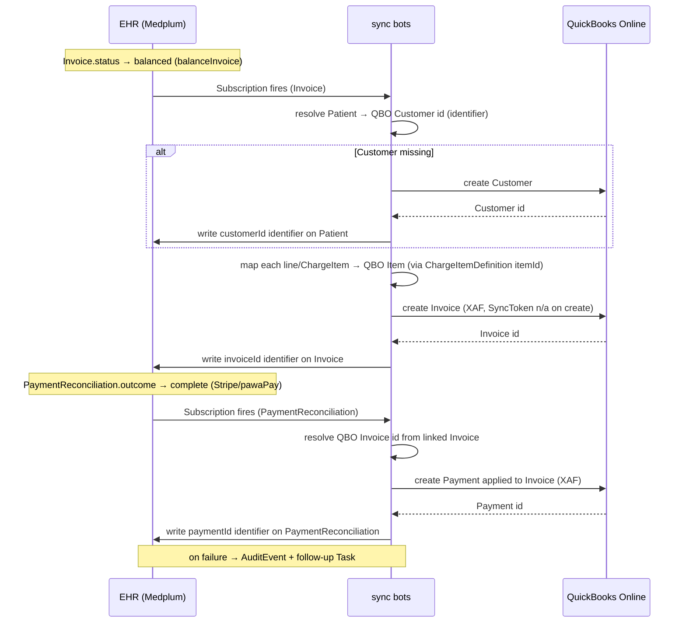
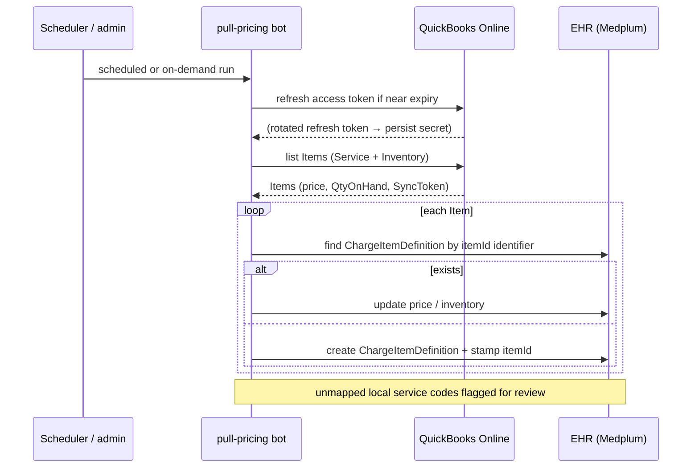

# QuickBooks Online (QBO) Integration — Design & Scoping

**Status:** Phases 1–2 **implemented** (server-side; see
[As built](#as-built-phases-12) below). Phase 3 (inventory, QBO webhooks,
multicurrency) remains unbuilt. This document is the authoritative design —
architecture, data mappings, sync directions, secrets, and phasing — for the
QuickBooks Online integration with the Premier Health Cameroon EHR (a Medplum
fork). Operational setup and the go-live checklist live in
[docs/quickbooks-setup.md](./quickbooks-setup.md). The open risks (see
[Open Risks](#2-open-risks--validate-first)) — above all QBO country
availability for Cameroon — must still be validated **before production
go-live**.

## As built (Phases 1–2)

Implemented per this design, with these deviations/refinements:

- **OAuth state is self-contained**, not server-stored: an HMAC-signed payload
  (projectId + expiry + nonce, keyed by `QUICKBOOKS_CLIENT_SECRET`, 10-min
  TTL), so the connect flow survives restarts and multiple instances
  (`packages/server/src/accounting/routes.ts`).
- **`/connect` returns the authorize URL as JSON** instead of a 302 —
  non-FHIR authenticated routes are bearer-authenticated, so the admin UI
  opens the URL itself.
- **Two extra server-managed secrets** beyond the table in §4:
  `QUICKBOOKS_ACCESS_TOKEN` and `QUICKBOOKS_ACCESS_TOKEN_EXPIRES_AT` (the
  cached access token is persisted so all instances reuse it).
  `QUICKBOOKS_BASE_URL` defaults to the **sandbox** when unset.
- **Sync logic lives in server FHIR operations, not in the bots**: Intuit
  refresh tokens rotate and must be re-persisted into project secrets, which
  bots cannot write. The bots stay thin and call `Invoice/$qbo-sync`
  (`packages/server/src/fhir/operations/qbosync.ts`), which pushes the
  Customer + Invoice **and** sweeps this invoice's settled
  PaymentReconciliations into QBO Payments in one idempotent operation.
  The pricing pull is the system-level `$qbo-pull-pricing` operation
  (`packages/server/src/fhir/operations/qbopullpricing.ts`).
- **Unmapped-line policy (interim answer to Open Risk #3):** invoice lines
  whose ChargeItem resolves to no QBO Item post against a default
  **“Healthcare Services”** Service item, found or created on first use
  against the company's first Income account.
- **Failure recording:** sync failures surface as operation errors
  (non-retryable 4xx vs retryable 5xx) to the calling bot; the
  `AuditEvent`/follow-up-`Task` recording from §9 is not yet built.

---

## 1. Goals

Automate the financial back-office so that the EHR and the accounting ledger stay
in sync without manual double-entry:

- **Push:** EHR **Invoices** and **payments** (from any rail — card via Stripe, or
  mobile money via pawaPay) flow automatically into QBO as QBO Invoices and QBO
  Payments applied against them.
- **Pull:** Service/item **pricing** and **inventory** are maintained in QBO (the
  finance team's source of truth) and pulled into the EHR's service catalog so
  clinical charge capture always prices against the current, accountant-approved
  rates.
- **Eliminate** manual re-keying of invoices, receipts, and price lists between
  the clinical system and the accounting system.

### Non-goals

- QBO is **not** the system of record for clinical or patient data; only the
  minimum needed to invoice (a QBO Customer per patient) is created.
- We do **not** compute foreign-exchange rates ourselves — see
  [Currency](#8-currency--multicurrency).
- Payroll, tax filing, and full general-ledger management remain in QBO's own UI;
  this integration only feeds it AR (accounts-receivable) data.

---

## 2. Open Risks — VALIDATE FIRST

These must be resolved **before any build begins**. Two of them can invalidate the
entire approach.

1. **QBO availability / region for Cameroon (BLOCKER).** Intuit QuickBooks Online
   is not sold in every country, and the Central African / Cameroon market may not
   be a supported QBO region. If a Cameroon-domiciled QBO company cannot be
   created, the options are: (a) operate a **US/global QBO company** and post XAF
   invoices into it (requires multicurrency, and raises tax/entity questions), or
   (b) select an **alternative ledger** (e.g. a locally-supported accounting
   package) and re-scope this document against its API. **Do not commit engineering
   time until an actual QBO company can be provisioned for the operating entity.**

2. **Multicurrency constraints.** The home ledger currency is **XAF**. QBO's
   multicurrency, once enabled on a company, is **irreversible** and changes how
   Customers, Items, and transactions behave. Confirm whether the QBO company's
   home currency can be XAF, and whether multicurrency is even needed (see
   [Currency](#8-currency--multicurrency)).

3. **Local service-code → QBO Item taxonomy mapping.** EHR charges are coded with
   clinical billing codes (CPT today; local Cameroon service codes likely).
   QBO Items are a flat finance taxonomy. A deliberate mapping table (and a policy
   for unmapped codes) is required so every ChargeItem resolves to exactly one QBO
   Item. Decide whether QBO Item is keyed by billing code, by `ChargeItemDefinition`,
   or by an explicit crosswalk.

---

## 3. Architecture Overview

The EHR is the **single orchestrator**. All money-related resources originate in
the EHR and are pushed to QBO over the Intuit REST API; pricing/inventory is
pulled the other way on a schedule and on demand.

```
                       ┌─────────────────────────────────────────────┐
                       │                 EHR (Medplum)               │
                       │                                             │
  Clinical charge      │  ChargeItem ─▶ Invoice ─▶ PaymentReconcil.  │
  capture              │      ▲            │             │           │
  (encounter.ts)       │      │            │ (balanced)  │ (settled) │
                       │      │            ▼             ▼           │
                       │  ChargeItemDefinition │   accounting/quickbooks.ts (provider)
                       │      ▲            │   token refresh + Customer/Item/     │
                       │      │ (upsert)   │   Invoice/Payment CRUD               │
                       └──────┼────────────┼──────────────┬─────────────────────┘
                              │ pull       │ push          │ push
                              │ (Items)    │ (Invoice)     │ (Payment)
                              ▼            ▼               ▼
                       ┌─────────────────────────────────────────────┐
                       │          QuickBooks Online (Intuit API)      │
                       │  Item │ Customer │ Invoice │ Payment         │
                       └─────────────────────────────────────────────┘
```

**Key components (where code will live when built):**

| Component                | Path                                                                                                | Responsibility                                                                                                                                                             |
| ------------------------ | --------------------------------------------------------------------------------------------------- | -------------------------------------------------------------------------------------------------------------------------------------------------------------------------- |
| QBO provider abstraction | `packages/server/src/accounting/quickbooks.ts`                                                      | OAuth token refresh + Customer / Item / Invoice / Payment CRUD, mirroring `packages/server/src/payments/stripe.ts` and `packages/server/src/payments/pawapay.ts`.          |
| OAuth connect routes     | new router, wired in `packages/server/src/app.ts`                                                   | `GET /api/accounting/quickbooks/connect` and `GET /api/accounting/quickbooks/callback`, mounted like `paymentsRouter` (see `apiRouter.use('/payments/', paymentsRouter)`). |
| Config resolver          | in `quickbooks.ts` (mirrors `getStripeConfig` in `packages/server/src/fhir/operations/checkout.ts`) | Resolve QBO project secrets → a typed `QuickBooksConfig`, with env-var fallback for single-tenant on-prem.                                                                 |
| Invoice push bot         | `examples/medplum-demo-bots/src/premierhealth/quickbooks-sync-invoice.ts`                           | Subscribed to Invoice → push to QBO on `status = balanced` (or on create, per phase).                                                                                      |
| Payment push bot         | `examples/medplum-demo-bots/src/premierhealth/quickbooks-sync-payment.ts`                           | Subscribed to PaymentReconciliation → push a QBO Payment when `outcome = complete`.                                                                                        |
| Pricing pull bot         | `examples/medplum-demo-bots/src/premierhealth/quickbooks-pull-pricing.ts`                           | Scheduled (cron) + on-demand: pull QBO Items → upsert `ChargeItemDefinition`s.                                                                                             |

### Design principle: mirror the existing payment provider surface

The two existing payment providers deliberately expose a **small, SDK-free
interface** so callers (operations, webhooks, bots) never depend on the vendor
SDK directly:

- `StripeProvider` in `packages/server/src/payments/stripe.ts` implements
  `CardPaymentProvider` (`createCheckoutSession`, `getSession`,
  `constructWebhookEvent`), taking a resolved `StripeConfig`.
- `PawaPayProvider` in `packages/server/src/payments/pawapay.ts` implements
  `PaymentProvider` (`initiateDeposit`, `getDeposit`) over plain `fetch`, taking a
  resolved `PawaPayConfig`.

The QBO provider will follow the same shape: a `QuickBooksProvider` class taking a
resolved `QuickBooksConfig`, exposing `findOrCreateCustomer`, `upsertInvoice`,
`recordPayment`, `listItems`, and an internal `getAccessToken` (token refresh).
Callers pass the config in; the class holds no ambient state.

---

## 4. Authentication (Intuit OAuth 2.0)

QBO uses the **OAuth 2.0 Authorization Code** flow, plus a company identifier
(`realmId`).

### One-time setup

1. Register an app in the Intuit Developer portal to obtain a **client id** and
   **client secret**.
2. Configure the redirect URI to the EHR callback:
   `https://<host>/api/accounting/quickbooks/callback`.
3. An admin runs the connect flow (below); Intuit returns the **realmId** (the QBO
   company id) plus an initial **access token** and **refresh token**.

### Token lifecycle (important)

- **Access tokens** live ~1 hour.
- **Refresh tokens** live ~100 days **and rotate**: each refresh may return a
  _new_ refresh token, and the old one is invalidated.
- Therefore the server must **refresh on demand** (whenever the access token is
  near expiry) and **persist the rotated refresh token** back into project secrets
  immediately. Failing to persist the rotated token bricks the connection until an
  admin re-authorizes.

### Connect flow (OAuth Authorization Code)

```
Admin browser        EHR (/connect, /callback)          Intuit
   │                        │                              │
   │  GET /connect          │                              │
   │───────────────────────▶│  build authorize URL w/      │
   │                        │  client_id, scope,           │
   │  302 to Intuit ◀───────│  redirect_uri, state         │
   │──────────────────────────────────────────────────────▶│  login + consent
   │                        │                              │
   │  302 back to /callback?code=…&realmId=… ◀─────────────│
   │───────────────────────▶│  exchange code → access +    │
   │                        │  refresh tokens ────────────▶│
   │                        │  ◀── tokens + realmId ───────│
   │                        │  persist QUICKBOOKS_REALM_ID  │
   │                        │  + QUICKBOOKS_REFRESH_TOKEN   │
   │  "Connected" ◀─────────│  as project secrets           │
```

### Secret storage — mirror the Stripe pattern

Secrets are stored as **project secrets** and resolved by a `getQuickBooksConfig`
helper that mirrors `getStripeConfig` in
`packages/server/src/fhir/operations/checkout.ts`: prefer the per-project secret,
fall back to a server env var for single-tenant on-prem deployments, and throw a
clear error if unconfigured. Example of the existing pattern being mirrored:

```ts
// packages/server/src/fhir/operations/checkout.ts (existing, for reference)
const secretKey =
  project.secret?.find((s) => s.name === 'STRIPE_SECRET_KEY')?.valueString ?? process.env.STRIPE_SECRET_KEY;
```

The rotated refresh token is written back with the project-secret write path
(the same mechanism the connect callback uses to persist the initial token).

### Required project secrets

| Secret name                | Purpose                                                                                                                           |
| -------------------------- | --------------------------------------------------------------------------------------------------------------------------------- |
| `QUICKBOOKS_CLIENT_ID`     | Intuit app client id (from Developer portal).                                                                                     |
| `QUICKBOOKS_CLIENT_SECRET` | Intuit app client secret.                                                                                                         |
| `QUICKBOOKS_REALM_ID`      | QBO company id, returned on the OAuth callback.                                                                                   |
| `QUICKBOOKS_REFRESH_TOKEN` | Current (rotating) refresh token; **overwritten on every refresh**.                                                               |
| `QUICKBOOKS_BASE_URL`      | Sandbox/production toggle. Production: `https://quickbooks.api.intuit.com`. Sandbox: `https://sandbox-quickbooks.api.intuit.com`. |

> Note: unlike Stripe (which has a signed-webhook secret), QBO's optional webhooks
> use a verifier token; add `QUICKBOOKS_WEBHOOK_VERIFIER_TOKEN` only in Phase 3 if
> QBO webhooks are adopted.

---

## 5. Entity Mapping (FHIR ↔ QBO)

Every QBO id is stored back onto the corresponding FHIR resource as an
**identifier**, so all sync operations are **idempotent** (find-by-identifier
before create). This is the same idempotency discipline the payment code already
uses — e.g. `PAWAPAY_DEPOSIT_SYSTEM` / `STRIPE_CHECKOUT_SESSION_SYSTEM` identifiers
correlate FHIR resources to external ids in
`packages/server/src/payments/routes.ts`.

| FHIR resource                                             | QBO entity                           | Direction                                                    | Identifier stored on FHIR resource                                                   |
| --------------------------------------------------------- | ------------------------------------ | ------------------------------------------------------------ | ------------------------------------------------------------------------------------ |
| `Patient`                                                 | Customer                             | EHR → QBO (lookup/create)                                    | `Patient.identifier`, system `https://quickbooks.intuit.com/customerId`              |
| `Invoice`                                                 | Invoice                              | EHR → QBO                                                    | `Invoice.identifier`, system `https://quickbooks.intuit.com/invoiceId`               |
| `Invoice.lineItem` / `ChargeItem`                         | Invoice Line → references a QBO Item | EHR → QBO (as part of Invoice push)                          | (line-level; resolved via the Item id on `ChargeItemDefinition`)                     |
| `PaymentReconciliation` (settled — Stripe **or** pawaPay) | Payment (applied to the QBO Invoice) | EHR → QBO                                                    | `PaymentReconciliation.identifier`, system `https://quickbooks.intuit.com/paymentId` |
| `ChargeItemDefinition` (service catalog)                  | Item (Service / Inventory)           | **QBO → EHR** (QBO is source of truth for price + inventory) | `ChargeItemDefinition.identifier`, system `https://quickbooks.intuit.com/itemId`     |

### Mapping details

- **Patient → Customer.** On first invoice for a patient, look up the QBO Customer
  by the stored `customerId` identifier; if absent, search QBO by name/email, else
  create a Customer and write the returned id back to `Patient.identifier`.

- **Invoice → Invoice.** Each EHR `Invoice.lineItem` (or the `ChargeItem`s that
  compose it) becomes a QBO Invoice Line referencing a QBO **Item**. The Item is
  resolved from the line's `ChargeItemDefinition`, which carries the QBO Item id (see
  pricing pull). Amounts post in **XAF** (invoice currency).

- **ChargeItem provenance.** ChargeItems are created during charge capture in
  `examples/medplum-provider/src/utils/encounter.ts`
  (`createChargeItemFromPlanDefinition` / `createChargeItemFromServiceRequest`),
  which set `ChargeItem.definitionCanonical` to a `ChargeItemDefinition` canonical URL
  and carry the billing code (`ServiceBillingCode` / CPT). That `ChargeItemDefinition`
  is the join point to the QBO Item — which is why pricing is pulled **onto**
  `ChargeItemDefinition` (below).

- **PaymentReconciliation → Payment.** When a PaymentReconciliation settles
  (`outcome = 'complete'`, set by the Stripe webhook or pawaPay callback in
  `packages/server/src/payments/routes.ts`), push a QBO Payment applied to the QBO
  Invoice referenced by that reconciliation. This works identically for card and
  mobile money because both rails converge on the same PaymentReconciliation shape.

- **QBO Item → ChargeItemDefinition.** QBO owns the price list and inventory. The
  pricing-pull bot upserts a `ChargeItemDefinition` per QBO Item, copying the price and
  (for inventory items) stock levels, and stamps the QBO Item id onto the
  ChargeItemDefinition identifier.

---

## 6. Sync Directions

### 6.1 Pricing & inventory: QBO → EHR (pull)

- **When:** scheduled (cron, via the pull bot) **and** on demand (admin-triggered).
- **What:** list QBO Items; **upsert** a `ChargeItemDefinition` for each (match by the
  stored QBO Item id, else create). Copy unit price → the ChargeItemDefinition's price
  component; for Inventory-type Items also copy `QtyOnHand`.
- **Source of truth:** QBO. The EHR never writes prices back to QBO.

### 6.2 Invoices & payments: EHR → QBO (push)

- **Invoice push** — trigger: Invoice becomes `balanced` (the state set by
  `balanceInvoice` in `packages/server/src/payments/routes.ts`). Optionally also
  push at `issued` in a later phase if AR aging needs open invoices in QBO.
- **Payment push** — trigger: PaymentReconciliation reaches `outcome = 'complete'`
  (Stripe webhook or pawaPay callback). Push a QBO Payment applied to the invoice.

### 6.3 Optional: QBO webhooks (Phase 3)

Subscribe to Intuit webhooks for **Item** create/update so price/inventory changes
propagate to `ChargeItemDefinition` in near-real-time instead of waiting for the next
scheduled pull. Requires the verifier token secret and a public callback route
(same wiring approach as the Stripe raw-body webhook in `app.ts`).

---

## 7. Stripe / pawaPay Relationship — Why the EHR Orchestrates

QBO ships a **native Stripe sync** (the QuickBooks Connector for Stripe), which
would auto-create QBO invoices/payments from Stripe activity. **We deliberately do
not rely on it**, for one decisive reason: it does **not** cover **pawaPay** —
mobile money, which is the **primary payment rail in Cameroon**.

If we let QBO's Stripe connector handle card payments while the EHR handles momo,
we get **split/double-entry**: card transactions land in QBO via two paths (Stripe
connector _and_ the EHR), and momo lands only via the EHR — a reconciliation mess.

**Recommendation:** the EHR is the **single orchestrator** and pushes both the
Invoice and the Payment to QBO via the API for **all** methods (card _and_ momo).
This unifies reconciliation, keeps one code path, and avoids double-counting.
Concretely: **disable/do not enable** the QBO Stripe connector for the invoicing
flow this integration owns.

---

## 8. Currency & Multicurrency

- Invoices are denominated and posted in the **home currency, XAF**. The QBO
  Invoice and QBO Payment both post in **XAF**.
- **Stripe Adaptive Pricing** means a foreign card payer may actually be **charged
  in a different currency** (USD/EUR/GBP) at Stripe's FX rate. The EHR already
  records this: the Stripe webhook in `packages/server/src/payments/routes.ts`
  overwrites `PaymentReconciliation.paymentAmount` with the _settled_ currency/
  amount, while `detail[0].amount` keeps the original XAF invoice amount (see the
  `fromStripeMinorUnits` handling and the `processNote` it writes).
- **Policy for QBO:** post the QBO **Payment in the invoice currency (XAF)** — the
  amount that clears the AR balance — and treat the settled foreign amount as
  metadata on the PaymentReconciliation, not as the QBO posting amount. We do
  **not** compute FX ourselves.
- **Decision needed:** confirm whether the QBO company needs **multicurrency
  enabled**. If the QBO home currency is XAF and all postings are XAF, multicurrency
  may be unnecessary; if the ledger must also record foreign settlement amounts,
  multicurrency (irreversible once on) is required. Tie this to
  [Open Risk #2](#open-risks--validate-first).

---

## 9. Reliability, Idempotency & Observability

- **Idempotency:** always find-by-stored-QBO-id before create (the identifier
  systems in [§5](#5-entity-mapping-fhir--qbo)). Re-running a bot must never create
  a duplicate QBO Customer/Invoice/Payment. This mirrors the existing
  "already finalized → no-op" guards in the payment webhooks (e.g. the
  `reconciliation.status !== 'draft'` short-circuit in `payments/routes.ts`).
- **Optimistic concurrency:** QBO uses a **`SyncToken`** on every entity. Updates
  must send the current `SyncToken`; a stale token → conflict. Read-before-update
  (or refetch-and-retry on conflict) for any QBO update.
- **Retries:** bots retry on transient failures (5xx, throttling, expired access
  token → refresh once and retry). Access-token refresh is transparent inside the
  provider.
- **Failure recording:** a sync that ultimately fails records an **`AuditEvent`**
  and/or opens a follow-up **`Task`** for the finance team, rather than silently
  dropping.
- **Sync status on the Invoice:** surface sync state on the `Invoice` (e.g. an
  extension or the presence/absence of the QBO invoice identifier) so operators can
  see at a glance which invoices have and haven't reached QBO.

---

## 10. Sequence Flows

### 10.1 Invoice + Payment push (EHR → QBO)



### 10.2 Pricing / inventory pull (QBO → EHR)



---

## 11. Phasing

**Phase 1 — Connect & invoice push**

- OAuth connect route pair + token storage (with rotation-persist).
- `getQuickBooksConfig` secret resolver.
- Patient → Customer lookup/create.
- Invoice push on `balanced`.

**Phase 2 — Payment push & pricing pull**

- PaymentReconciliation → QBO Payment (card + momo).
- Pull QBO Items → upsert `ChargeItemDefinition` (pricing).

**Phase 3 — Inventory, reconciliation & webhooks**

- Inventory sync (`QtyOnHand`).
- Scheduled reconciliation/backfill sweep.
- QBO webhooks for Item/price changes.
- Multicurrency (only if [§8](#8-currency--multicurrency) / Open Risk #2 require it).

---

## 12. Open Questions / Decisions Needed

1. **Region (blocker):** Can a QBO company be provisioned for the operating entity's
   jurisdiction? If not — US/global QBO company, or alternative ledger? (Open Risk #1.)
2. **Multicurrency:** Enable it? Can the QBO home currency be XAF? (Open Risk #2 / §8.)
3. **Item taxonomy:** How are EHR billing codes crosswalked to QBO Items — by code,
   by ChargeItemDefinition, or an explicit table? What happens to unmapped codes?
   (Open Risk #3.)
4. **Multi-tenancy:** Is this single-tenant on-prem (env-var secrets) or true
   multi-tenant (per-project secrets + per-project realmId + per-project webhook
   routing)? The Stripe webhook code notes the same multi-tenant limitation.
5. **Invoice push trigger:** push at `balanced` only, or also at `issued` (open AR
   in QBO for aging)?
6. **Customer matching:** when no stored `customerId`, match existing QBO Customers
   by name/email, or always create new (risking duplicates)?
7. **Payment posting currency:** confirm QBO Payments always post in XAF and the
   foreign settled amount stays as PaymentReconciliation metadata (§8).
8. **Refunds / voids / adjustments:** out of scope for v1 — confirm they're handled
   manually in QBO for now.
9. **Which project secrets are the source of truth** for the rotating refresh token
   in a multi-tenant deployment, and the write path used by the callback to persist
   rotation.

---

## 13. Reference — Existing Code Touchpoints

| Concern                                                    | File                                                                                                                |
| ---------------------------------------------------------- | ------------------------------------------------------------------------------------------------------------------- |
| Card provider surface to mirror                            | `packages/server/src/payments/stripe.ts`                                                                            |
| Mobile-money provider surface to mirror                    | `packages/server/src/payments/pawapay.ts`                                                                           |
| Project-secret resolver pattern (`getStripeConfig`)        | `packages/server/src/fhir/operations/checkout.ts`                                                                   |
| Webhook handlers, idempotency guards, `balanceInvoice`     | `packages/server/src/payments/routes.ts`                                                                            |
| Raw-body webhook + router wiring                           | `packages/server/src/app.ts`                                                                                        |
| ChargeItem creation from PlanDefinition / ServiceRequest   | `examples/medplum-provider/src/utils/encounter.ts`                                                                  |
| Existing premierhealth bots (convention for new sync bots) | `examples/medplum-demo-bots/src/premierhealth/`                                                                     |
| **New:** QBO provider abstraction                          | `packages/server/src/accounting/quickbooks.ts`                                                                      |
| **New:** OAuth connect routes                              | wired in `packages/server/src/app.ts`                                                                               |
| **New:** sync bots                                         | `examples/medplum-demo-bots/src/premierhealth/quickbooks-sync-invoice.ts`, `…-sync-payment.ts`, `…-pull-pricing.ts` |
